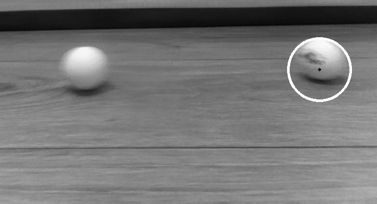
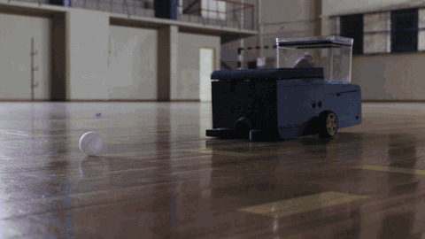
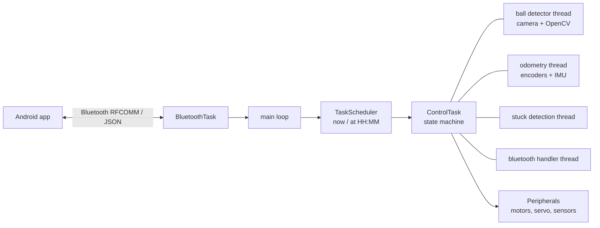
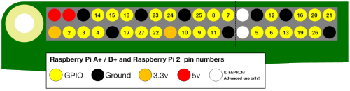

# ASH — Autonomous Table Tennis Ball Fetcher

Controller software for **ASH**, a robot that searches a room for table tennis balls, collects them
and returns to its charging base on its own. Raspberry Pi 5 · Python · OpenCV · multithreading.
University team project (UTFPR, 2024).

<p align="center">
  
  &nbsp;<b>➡️</b>&nbsp;
  
</p>

## What it does

1. Starts a cleaning routine **on demand or on a schedule**, commanded from an Android app over Bluetooth.
2. **Searches for balls** with the camera (Hough circle detection) and estimates distance with
   **stereo depth** (OpenCV StereoSGBM).
3. **Drives to the ball** with differential drive and encoder feedback, and collects it with a vacuum motor.
4. **Avoids walls and obstacles** with four ultrasonic sensors and **detects when it is stuck**
   (encoder progress vs. motor PWM).
5. **Returns to the base** by tracking an infrared beacon and docks to charge.
6. Reports its state to the app as JSON throughout the routine.

## Architecture



The control loop is a **state machine with ~20 states**, among them `SEARCHING_BALLS`,
`CATCHING_BALL`, `AVOIDING_WALL`, `AVOIDING_STATIC_OBJECT`, `ROBOT_STUCK`, `BALL_STUCK`,
`GOING_AFTER_BASE_CAM`, `CONNECTING_TO_BASE` and `CHARGING`. Sensing runs in separate threads and
feeds the state machine through shared state and queues, so camera latency never blocks motor control.

| Path | Content |
|---|---|
| `src/main.py` | Entry point: Bluetooth listener, scheduler, status relay to the app |
| `src/controlTask.py` | State machine, vision and odometry threads |
| `src/auxClasses/` | Peripherals abstraction, encoders, IR sensors, stuck detector, BT message parsing |
| `detector/` | Standalone ball detection and calibration scripts |
| `simulator/` | Navigation algorithms tested in a 2D simulator before running on the robot |
| `tester/` | Hardware bring-up tests: GPIO, motors, IMU, ADC, ultrasonic sensors |

## Hardware

Raspberry Pi 5 with a Pi camera, two DC motors with quadrature encoders, servo, vacuum motor,
4× ultrasonic sensors, 2× infrared sensors, hall-effect sensor, ADS1115 ADC and ICM-20x IMU on I²C,
on a custom PCB. <!-- TODO(verificar): lista de hardware e se a PCB foi sua -->

<details>
<summary>GPIO map</summary>

| Function | GPIO (pin) |
|---|---|
| Right motor IN1 / IN2 | 20 (38) / 21 (40) |
| Right encoder A / B | 16 (36) / 25 (22) |
| Left motor IN1 / IN2 | 19 (35) / 26 (37) |
| Left encoder A / B | 6 (31) / 5 (29) |
| Servo PWM | 24 (18) |
| I²C SDA / SCL | 2 (3) / 3 (5) |
| Hall-effect sensor | 23 (16) |
| Infrared front / back | 14 (8) / 15 (10) |
| Ultrasonic trigger (shared) | 17 (11) |
| Ultrasonic echo 1–4 | 27 (13), 22 (15), 10 (19), 9 (21) |

</details>

## Running

```bash
pip install opencv-python picamera2 gpiozero schedule pybluez adafruit-circuitpython-ads1x15 adafruit-circuitpython-icm20x
python src/main.py
```
<!-- TODO(verificar): comando real de execução no Pi (serviço systemd?) -->

## Team

Built by a team of three at UTFPR:
- **João Vitor Caversan**
- **Guilherme Gomes Barboza**
- **Matheus Diniz de Freitas**

---

# GPIO configuration:
Here is the GPIO configuration for Raspberry Pi boards:


## Used pins
GPIO20 (Pin 38) - Right Motor IN1 \
GPIO21 (Pin 40) - Right Motor IN2 \
GPIO16 (Pin 36) - Right Motor encoder feedback 1 \
GPIO25 (Pin 22) - Right Motor encoder feedback 2 

GPIO19 (Pin 35) - Left Motor IN1 \
GPIO26 (Pin 37) - Left Motor IN2 \
GPIO6  (Pin 31) - Left Motor encoder feedback 1 \
GPIO5  (Pin 29) - Left Motor encoder feedback 2 

GPIO24 (Pin 18) - Servo Motor PWM 

GPIO2  (Pin 3) - I2C SDA \
GPIO3  (Pin 5) - I2C SCL 

GPIO23 (Pin 16) - Hall effect sensor 

GPIO14 (Pin 8) - Infrared sensor front \
GPIO15 (Pin 10) - Infrared sensor back 

GPIO17 (Pin 11) - Ultrasonic sensor trigger FOR ALL 4 SENSORS \
GPIO27 (Pin 13) - Ultrasonic sensor 1 echo \
GPIO22 (Pin 15) - Ultrasonic sensor 2 echo \
GPIO10 (Pin 19) - Ultrasonic sensor 3 echo \
GPIO9  (Pin 21) - Ultrasonic sensor 4 echo 

## Available pins
GPIO4  (Pin 7) \
GPIO7  (Pin 26) \
GPIO8  (Pin 24) \
GPIO11 (Pin 23) \
GPIO12 (Pin 33 - PWM0) \
GPIO13 (Pin 33 - PWM1) \
GPIO18 (Pin 12)

---

© 2024 the ASH team. All rights reserved.